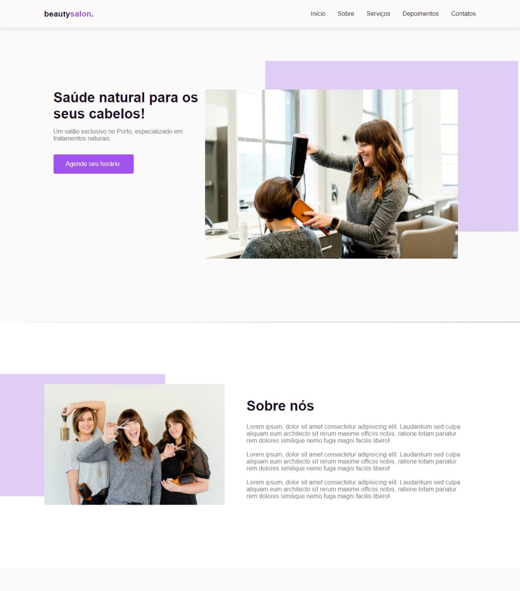

# BeautySalon

  

### 🚀 Tecnologias

Esse projeto foi desenvolvido com as seguintes tecnologias:

- HTML
- CSS
- JavaScript

**Bibliotecas**

- [Google Fonts](https://fonts.google.com/)
- [SwipeJS](https://github.com/nolimits4web/Swiper)
- [ScrollRevel](https://scrollrevealjs.org)

**Utilitários**

- [randomuser.me](https://randomuser.me/photos)
- [IconMoon](https://icomoon.io/app/#/select)

### 💻 Projeto

BeautySalon é uma página construída com o objetivo de atingir o público de cabeleireiros, utilizando-se da responsividade, para a utilizaçãoo em diversos ecrãs.

Contém como seções: 
- Header
- Navigation
- Home
- Sobre
- Serviços
- Depoimentos
- Contato
- Footer

### 🔖 Layout

Você pode visualizar o layout do projeto <a href="https://www.figma.com/file/HhmBQpyaYLCzxC06LdtZSU/BeautySalon?node-id=0%3A1" target="_blank"><strong>aqui</strong><a/>. 
